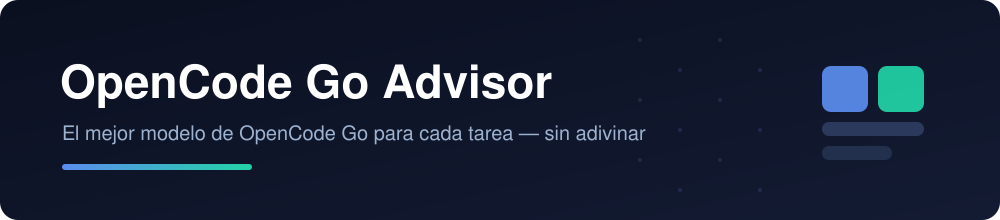

<div align="center">



<br/>

[](./LICENSE)
[](./CHANGELOG.md)
[](https://nodejs.org)
[](https://opencode.ai)
[](#)

</div>

**Elegí el mejor modelo de OpenCode Go para cada tarea —con la variante de esfuerzo correcta— sin adivinar.** El catálogo se mantiene actualizado solo desde la documentación oficial.

> Pensado para quienes usan el plan **OpenCode Go** ($10) o **Go Plus** ($40).

## Qué hace

- **Catálogo auto-actualizable**: modelos, precios, límites mensuales, peticiones estimadas por 5 h y políticas de privacidad, parseados de la doc oficial.
- **Recomendador por tarea**: le decís qué vas a hacer (frontend, refactor, debugging, visión, seguridad, ofimática…) y te devuelve el modelo + variante.
- **Barra de estado en vivo** en la TUI: muestra el modelo recomendado para tu último prompt y si el actual coincide.
- **Tecla `ctrl+alt+v`**: aplica la variante recomendada al modelo actual.
- **MCP, skill, agente y comando** listos para usar desde el chat.

## Requisitos

- **OpenCode V2**
- **Node.js ≥ 18**
- **git** (solo para la actualización automática)

## Instalación

### Opción A — un comando (recomendada)

```sh
npx github:gambaruCien/opencode-go-advisor
```

Copia los componentes a tu config global de OpenCode, registra el MCP y genera el catálogo.

### Opción B — clonar

```sh
git clone https://github.com/gambaruCien/opencode-go-advisor
cd opencode-go-advisor
node install.mjs
```

**Después reiniciá OpenCode.** Verificá:

```sh
opencode plugin list   # debe listar "opencode-go.status"
opencode mcp list      # debe listar "opencode-go-advisor"
```

## Uso

| Forma | Cómo |
| --- | --- |
| Barra de estado | `⚡ Go · <modelo>` o `⚡ sug: <modelo>#<variante>` (marca ⚠ si entrena con tus datos) |
| Comando | `/mejor-modelo refactor grande de un monorepo` |
| Tecla | `ctrl+alt+v` aplica la variante recomendada |
| Lenguaje natural | "¿qué modelo me conviene para analizar capturas de pantalla?" |
| MCP | `recommend_model`, `best_high_volume`, `list_models`, `model_detail`, `refresh_catalog`, `catalog_status` |

## Actualización

- **Datos** (modelos, precios, límites): **automático** (el MCP refresca a los 7 días; el plugin también en segundo plano).
- **Motor** (lógica, plugin, skill): 

```sh
node update.mjs --source https://github.com/gambaruCien/opencode-go-advisor.git
```

Para que se actualice **solo**, definí el origen y olvidate:

```sh
# Windows
setx OPENCODE_GO_ADVISOR_SOURCE "https://github.com/gambaruCien/opencode-go-advisor.git"
# Linux/macOS (agregar a ~/.bashrc o ~/.zshrc)
export OPENCODE_GO_ADVISOR_SOURCE="https://github.com/gambaruCien/opencode-go-advisor.git"
```

Con eso, el plugin ejecuta `update.mjs` en segundo plano cuando el motor supera los 14 días. Además, la barra muestra **`↻`** a los 30 días como recordatorio.

## Desinstalar

Borrá del config global (`~/.config/opencode` o `%USERPROFILE%\.config\opencode`):

```
opencode-go-advisor/          (motor)
plugins/opencode-go-status/   (barra de estado)
skills/opencode-go-advisor/   (skill)
agents/model-advisor.md       (agente)
commands/mejor-modelo.md      (comando)
```

Y quitá las entradas `opencode-go-advisor` y `context7` de `mcp.servers` en `opencode.jsonc`.

## Privacidad

Los modelos **Muse Spark 1.3/1.2 Contributor** (de Meta) **entrenan con tus prompts y respuestas** a cambio de precios muy bajos. Se incluyen en las recomendaciones pero se marcan con **⚠️**. No los uses con código propietario ni datos sensibles.

## Licencia

MIT — ver [LICENSE](./LICENSE).
